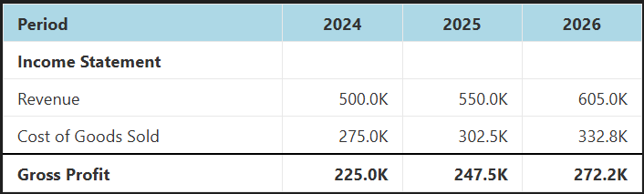

# Tables

Tables are the primary output format. A `Table` is a 2-D grid of styled cells that can be exported to HTML, Excel, a pandas DataFrame, or displayed inline in Jupyter.



---

## The `model.tables` namespace

All table methods live on `model.tables`.

### `line_items()` — full model table

```python
# All line items, names as row labels
model.tables.line_items().show()

# Specific items only
model.tables.line_items(line_items=["revenue", "gross_profit", "net_income"]).show()

# Show label instead of name
model.tables.line_items(include_name=False, include_label=True).show()

# Without the auto-generated Total row
model.tables.line_items(include_total_row=False).show()
```

### `line_item()` — single item with optional analysis rows

```python
model.tables.line_item("revenue").show()

# Period-over-period % change
model.tables.line_item("revenue", include_percent_change=True).show()

# Cumulative change from base period
model.tables.line_item("revenue", include_cumulative_change=True).show()

# Cumulative % change from base period
model.tables.line_item("revenue", include_cumulative_percent_change=True).show()

# All analysis rows together
model.tables.line_item(
    "revenue",
    include_percent_change=True,
    include_cumulative_change=True,
    include_cumulative_percent_change=True,
).show()
```

### `precedents()` — formula dependency view

Shows what feeds into a `FormulaLine`. Precedent items appear above a border; the calculated item is shown in bold below it. Useful for auditing formulas.

```python
model.tables.precedents("net_income").show()
```

For non-formula items (like `FixedLine`), only the item itself is shown in bold.

### Convenience shortcut from `LineItemResult`

```python
model["revenue"].table(include_percent_change=True).show()
# equivalent to model.tables.line_item("revenue", include_percent_change=True)
```

---

## Custom tables with `from_template()`

Build any table layout by passing a list of row type instances to `from_template()`. This is the most flexible approach.

```python
from pyproforma.tables import HeaderRow, LabelRow, ItemRow, BlankRow, LineItemsTotalRow

table = model.tables.from_template([
    HeaderRow(),
    LabelRow(label="Revenue"),
    ItemRow(name="product_revenue"),
    ItemRow(name="service_revenue", bottom_border="single"),
    LineItemsTotalRow(
        line_item_names=["product_revenue", "service_revenue"],
        label="Total Revenue",
        bold=True,
    ),
    BlankRow(),
    LabelRow(label="Expenses"),
    ItemRow(name="cogs"),
    ItemRow(name="operating_expenses", bottom_border="single"),
    LineItemsTotalRow(
        line_item_names=["cogs", "operating_expenses"],
        label="Total Expenses",
        bold=True,
    ),
])
table.show()
```

Row configs can also be passed as plain dicts with a `"row_type"` key if you prefer:

```python
template = [
    {"row_type": "header"},
    {"row_type": "label", "label": "Income Statement"},
    {"row_type": "item", "name": "revenue"},
    {"row_type": "blank"},
]
model.tables.from_template(template).show()
```

---

## Row types reference

| Row type | Key parameters | Description |
|---|---|---|
| `HeaderRow(col_labels)` | `col_labels` | Column headers. Defaults to `"Label"`. |
| `ItemRow(name, ...)` | `name`, `label`, `bold`, `top_border`, `bottom_border`, `hardcoded_color` | Single line item row. |
| `LabelRow(label, bold)` | `label`, `bold` | Section header spanning all columns. |
| `BlankRow()` | — | Empty row for visual spacing. |
| `PercentChangeRow(name)` | `name` | Period-over-period % change. |
| `CumulativeChangeRow(name)` | `name` | Change from base period, in original units. |
| `CumulativePercentChangeRow(name)` | `name` | % change from base period. |
| `LineItemsTotalRow(line_item_names, label, ...)` | `line_item_names`, `label`, `bold`, `top_border`, `bottom_border` | Sum of named items. |
| `TagTotalRow(tag, label)` | `tag`, `label` | Sum of all items with a given tag. |

### `ItemRow` options

```python
ItemRow(
    name="revenue",
    label="Custom Label",        # overrides the line item's label
    bold=True,
    top_border="single",         # or "double"
    bottom_border="single",
    hardcoded_color="steelblue", # highlights fixed-value periods in that color
)
```

`hardcoded_color` is useful for distinguishing input cells from calculated cells in auditing workflows.

### Tag-based rows

`TagTotalRow` sums all line items with the given tag — the list is resolved at render time from the model, so the table stays correct if you add or remove tagged items.

```python
from pyproforma.tables import TagTotalRow

model.tables.from_template([
    HeaderRow(),
    ItemRow(name="product_revenue"),
    ItemRow(name="service_revenue", bottom_border="single"),
    TagTotalRow(tag="revenue", label="Total Revenue", bold=True),
])
```

---

## Exporting a table

Every `Table` object supports the same set of export methods:

```python
table = model.tables.line_items()

table.show()                      # display inline in Jupyter (renders as HTML)
table.to_html()                   # returns HTML string (inline CSS styling)
table.to_bootstrap_html()         # returns HTML string (Bootstrap CSS classes)
table.to_excel("output.xlsx")     # write to Excel with formatting preserved
table.to_dataframe()              # pandas DataFrame with string-formatted values
table.to_styled_dataframe()       # pandas Styler object
table.to_json()                   # JSON string
```

### Excel export

Formatting (bold, borders, background colours, number formats) is fully preserved in the Excel output via openpyxl.

```python
model.tables.line_items().to_excel("income_statement.xlsx")
```

### HTML export

`to_html()` produces self-contained HTML with inline CSS — safe to embed in any page without a stylesheet.

`to_bootstrap_html()` produces HTML that relies on Bootstrap classes — used by the Flask explorer app.
