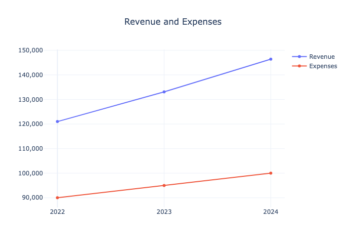

# Basic Usage

This guide covers the fundamental operations and concepts in PyProforma.

## Creating a Model

Start by importing the required classes and creating line items and a model:

```python
from pyproforma import Model, LineItem

years = [2022, 2023, 2024]

revenue = LineItem(
    name="revenue",
    category="income",
    values={
        2022: 121000, 
        2023: 133100,
        2024: 146410
    }
)

expense = LineItem(
    name="expenses", 
    category="costs",
    values={
        2022: 90000,
        2023: 95000, 
        2024: 100000
    }
)

net_income = LineItem(
    name="net_income",
    category="profit", 
    formula="revenue - expenses"
)

model = Model(
    line_items=[revenue, expense, net_income],
    years=years
)
```

## Creating Tables

PyProforma makes it easy to generate formatted tables from your model data. Use the [`tables`](../api/tables.md) namespace to create various types of tables:

```python
from pyproforma import row_types as rt

template = [
    rt.ItemRow('revenue'),    
    rt.ItemRow('expenses'),
    rt.ItemRow('net_income', bold=True),
]

model.tables.from_template(template)
```

This returns a [`Table`](../api/table.md) object that can be viewed directly in a notebook, converted to a pandas DataFrame, or exported to Excel. When displayed in a notebook, it will show a formatted table like this:

<style type="text/css">
#T_ad88c_row0_col0, #T_ad88c_row1_col0 {
  text-align: left;
}
#T_ad88c_row0_col1, #T_ad88c_row0_col2, #T_ad88c_row0_col3, #T_ad88c_row1_col1, #T_ad88c_row1_col2, #T_ad88c_row1_col3 {
  text-align: right;
}
#T_ad88c_row2_col0 {
  font-weight: bold;
  text-align: left;
}
#T_ad88c_row2_col1, #T_ad88c_row2_col2, #T_ad88c_row2_col3 {
  font-weight: bold;
  text-align: right;
}
</style>
<table id="T_ad88c">
  <thead>
    <tr>
      <th class="blank level0" >&nbsp;</th>
      <th id="T_ad88c_level0_col0" class="col_heading level0 col0" >Year</th>
      <th id="T_ad88c_level0_col1" class="col_heading level0 col1" >2022</th>
      <th id="T_ad88c_level0_col2" class="col_heading level0 col2" >2023</th>
      <th id="T_ad88c_level0_col3" class="col_heading level0 col3" >2024</th>
    </tr>
  </thead>
  <tbody>
    <tr>
      <th id="T_ad88c_level0_row0" class="row_heading level0 row0" >0</th>
      <td id="T_ad88c_row0_col0" class="data row0 col0" >Revenue</td>
      <td id="T_ad88c_row0_col1" class="data row0 col1" >121,000</td>
      <td id="T_ad88c_row0_col2" class="data row0 col2" >133,100</td>
      <td id="T_ad88c_row0_col3" class="data row0 col3" >146,410</td>
    </tr>
    <tr>
      <th id="T_ad88c_level0_row1" class="row_heading level0 row1" >1</th>
      <td id="T_ad88c_row1_col0" class="data row1 col0" >Expenses</td>
      <td id="T_ad88c_row1_col1" class="data row1 col1" >90,000</td>
      <td id="T_ad88c_row1_col2" class="data row1 col2" >95,000</td>
      <td id="T_ad88c_row1_col3" class="data row1 col3" >100,000</td>
    </tr>
    <tr>
      <th id="T_ad88c_level0_row2" class="row_heading level0 row2" >2</th>
      <td id="T_ad88c_row2_col0" class="data row2 col0" >Net Income</td>
      <td id="T_ad88c_row2_col1" class="data row2 col1" >31,000</td>
      <td id="T_ad88c_row2_col2" class="data row2 col2" >38,100</td>
      <td id="T_ad88c_row2_col3" class="data row2 col3" >46,410</td>
    </tr>
  </tbody>
</table>

## Creating Charts

PyProforma also provides interactive chart capabilities using the [`charts`](../api/charts.md) namespace. You can create visualizations of your model data:

```python
# Create a chart comparing multiple line items
fig = model.charts.line_items(
    ['revenue', 'expenses'],
    title="Revenue and Expenses"
)

# Display the chart
fig.show()

# Or save it as an image
fig.write_image('../assets/images/revenue_expenses_chart.png')
```

This creates an interactive Plotly chart that shows the trend of revenue and expenses over time:


