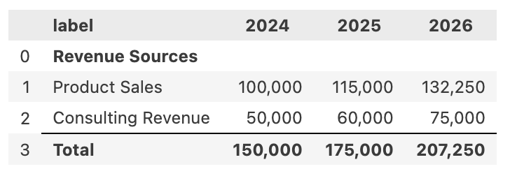
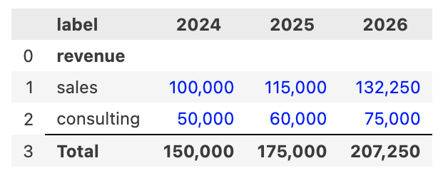

# Working with Categories

Categories provide a powerful way to organize and group related line items in your PyProforma financial models. They enable you to structure your financial statements logically, calculate category totals, and analyze groups of related items together. This guide shows you how to create, manage, and work with categories effectively.

## Understanding Categories

Categories are organizational containers that group related line items together. They serve several important purposes:

- **Organization**: Group related line items (e.g., all revenue sources, all operating expenses)
- **Analysis**: Calculate totals and perform analysis at the category level
- **Structure**: Create logical financial statement layouts
- **Flexibility**: Easily reorganize and manage groups of line items

## Creating Categories

There are several ways to create and work with categories in your models:

### Automatic Category Creation

The simplest approach is to let PyProforma automatically create categories when you assign line items to them:

```python
from pyproforma import Model

# Create model and assign line items to categories
model = Model(years=[2024, 2025, 2026])

# Categories are created automatically when first referenced
model['sales'] = {"category": "revenue", "values": {2024: 100000, 2025: 115000, 2026: 132250}}
model['consulting'] = {"category": "revenue", "values": {2024: 50000, 2025: 60000, 2026: 75000}}
model['salaries'] = {"category": "expenses", "values": {2024: 80000, 2025: 85000, 2026: 90000}}
model['rent'] = {"category": "expenses", "values": {2024: 24000, 2025: 25000, 2026: 26000}}

# Categories 'revenue' and 'expenses' are now available
print(model.category_names)  # ['revenue', 'expenses']
```

### Explicit Category Creation

You can also create categories explicitly using the `Category` class:

```python
from pyproforma import Model, Category, LineItem

# Create categories first
revenue_category = Category(
    name="revenue",
    label="Revenue Sources"
)

expenses_category = Category(
    name="operating_expenses", 
    label="Operating Expenses"
)

# Create line items with categories
sales = LineItem(
    name="sales",
    category="revenue",
    label="Product Sales",
    values={2024: 100000, 2025: 115000, 2026: 132250}
)

consulting = LineItem(
    name="consulting",
    category="revenue", 
    label="Consulting Revenue",
    values={2024: 50000, 2025: 60000, 2026: 75000}
)

# Create model with explicit categories
model = Model(
    line_items=[sales, consulting],
    years=[2024, 2025, 2026],
    categories=[revenue_category, expenses_category]
)
```

### Adding Categories to Existing Models

You can add new categories to existing models:

```python
# Add a new category
model.add_category(name="metrics", label="Key Metrics")

# Or add with Category object
from pyproforma import Category
new_category = Category(name="ratios", label="Financial Ratios")
model.add_category(category=new_category)

print(model.category_names)  # Now includes 'metrics' and 'ratios'
```

## Accessing Categories

Once categories exist in your model, you can access them through `CategoryResults` objects:

```python
# Access a category (returns CategoryResults object)
revenue_category = model.category('revenue')

print(revenue_category.name)           # 'revenue'
print(revenue_category.label)          # 'Revenue Sources' (or name if no label)
print(revenue_category.line_item_names) # ['sales', 'consulting']
```

### CategoryResults Properties

The `CategoryResults` object provides access to category metadata and methods:

```python
revenue_category = model.category('revenue')

# Properties
print(revenue_category.name)            # Category name
print(revenue_category.label)           # Display label
print(revenue_category.line_item_names) # List of line item names in category
```

## Category Analysis

Categories provide powerful analysis capabilities for groups of line items:

### Category Totals

Calculate totals for all line items in a category:

```python
revenue_category = model.category('revenue')

# Get total for a specific year
total_2024 = revenue_category.total(2024)
print(f"Total Revenue 2024: ${total_2024:,}")  # Total Revenue 2024: $150,000

# Get totals for all years
all_totals = revenue_category.total()  # Returns dict {2024: 150000, 2025: 175000, ...}
```

### Category Values

Access values for all line items in a category:

```python
# Get all values for items in the category
category_values = revenue_category.values()
# Returns: {'sales': {2024: 100000, 2025: 115000, ...}, 'consulting': {...}}

# Access individual line items in the category
for item_name in revenue_category.line_item_names:
    item = model.line_item(item_name)
    print(f"{item.label}: {item.values}")
```

## Creating Tables for Categories

Generate formatted tables for entire categories:

```python
# Create a table for a category
revenue_table = model.category('revenue').table()
revenue_table  # Displays formatted table in notebook
```

{ width="300" }

```python
# Customize table appearance
revenue_table = model.category('revenue').table(hardcoded_color='blue')
revenue_table  # Display formatted table with colored hardcoded values
```

{ width="300" }

## Creating Charts for Categories

Generate visual representations of category data:

```python
# Create charts for category analysis
revenue_category = model.category('revenue')

# Line chart showing all items in the category
revenue_chart = model.charts.line_chart(revenue_category.line_item_names)
revenue_chart.show()

# Pie chart showing composition for a specific year
pie_chart = model.charts.pie_chart(
    revenue_category.line_item_names, 
    year=2024,
    title="Revenue Composition 2024"
)
pie_chart.show()
```

{ width="700" }

## Converting Categories to DataFrames

Export category data to pandas DataFrames for further analysis:

```python
# Convert category to DataFrame
revenue_df = model.category('revenue').to_dataframe()
print(revenue_df)
#          2024    2025    2026
# sales   100000  115000  132250
# consulting 50000   60000   75000

# Include additional columns
detailed_df = model.category('revenue').to_dataframe(
    line_item_as_index=False,
    include_label=True,
    include_category=True
)
print(detailed_df)
#         name         label  category    2024    2025    2026
# 0      sales  Product Sales   revenue  100000  115000  132250
# 1  consulting Consulting...   revenue   50000   60000   75000
```

## Managing Line Items in Categories

### Moving Line Items Between Categories

```python
# Move a line item to a different category
model.line_item('sales').category = 'top_line_revenue'

# Move multiple line items at once
revenue_items = model.line_items(['sales', 'consulting'])
revenue_items.set_category('income_statement')
```

### Checking Category Membership

```python
# Get line items by category
revenue_items = model.line_item_names_by_category('revenue')
print(revenue_items)  # ['sales', 'consulting']

# Get all categories and their items
all_categories = model.line_item_names_by_category()
print(all_categories)
# {'revenue': ['sales', 'consulting'], 'expenses': ['salaries', 'rent']}
```

## Category Management

### Modifying Category Properties

```python
# Update category properties
revenue_category = model.category('revenue')
revenue_category.name = 'total_revenue'  # Updates throughout model
revenue_category.label = 'Total Revenue Sources'

# Verify changes
print(model.category_names)  # Now includes 'total_revenue' instead of 'revenue'
```

### Reordering Categories

```python
# Reorder categories for better organization
model.reorder_categories(['revenue', 'expenses', 'metrics'])

# Place categories at specific positions
model.reorder_categories(['metrics'], position='bottom')
model.reorder_categories(['revenue'], position='top')
```

### Deleting Categories

```python
# Delete empty categories
metrics_category = model.category('metrics')
metrics_category.delete()  # Only works if category has no line items

# Delete category and all its line items
expenses_category = model.category('expenses')
expenses_category.delete(include_line_items=True)  # Deletes category and items
```

## Working with Category Totals

You can create line items that automatically calculate the total of all line items in a category using the special `category_total:category_name` formula syntax:

```python
# Create line items that sum categories
model['total_revenue'] = {"formula": "category_total:revenue", "category": "totals"}
model['total_expenses'] = {"formula": "category_total:expenses", "category": "totals"}

# Access the calculated totals
total_rev_2024 = model.value('total_revenue', 2024)  # Sum of all revenue items
total_exp_2024 = model.value('total_expenses', 2024)  # Sum of all expense items

# Use category totals in other formulas
model['profit'] = {"formula": "total_revenue - total_expenses", "category": "results"}
model['profit_margin'] = {"formula": "profit / total_revenue", "category": "metrics"}
```

### Creating Category Total Line Items

The `category_total:category_name` formula creates a line item that dynamically sums all items in the specified category:

```python
from pyproforma import Model, LineItem

# Create model with revenue items
model = Model(years=[2024, 2025, 2026])

# Add revenue line items
model['sales'] = {"category": "revenue", "values": {2024: 100000, 2025: 115000, 2026: 132250}}
model['consulting'] = {"category": "revenue", "values": {2024: 50000, 2025: 60000, 2026: 75000}}

# Create a category total line item
model['total_revenue'] = {
    "formula": "category_total:revenue",
    "category": "totals",
    "label": "Total Revenue"
}

# The total automatically sums all revenue items
print(f"Total Revenue 2024: ${model.value('total_revenue', 2024):,}")
# Output: Total Revenue 2024: $150,000
```

### Using LineItem Class for Category Totals

You can also create category totals using the `LineItem` class:

```python
from pyproforma import LineItem

# Create category total line items
total_revenue = LineItem(
    name="total_revenue",
    label="Total Revenue",
    category="totals",
    formula="category_total:revenue"
)

total_expenses = LineItem(
    name="total_expenses", 
    label="Total Expenses",
    category="totals",
    formula="category_total:expenses"
)

# Add to model
model.add_line_item(total_revenue)
model.add_line_item(total_expenses)
```

### Category Totals with Spaces

The formula syntax supports optional spaces after the colon:

```python
# Both of these work identically
model['total_rev'] = {"formula": "category_total:revenue"}
model['total_exp'] = {"formula": "category_total: expenses"}  # Space after colon
```

### Dynamic Updates

Category totals automatically update when you add, remove, or modify line items in the category:

```python
# Initial total
print(f"Revenue total: ${model.value('total_revenue', 2024):,}")

# Add new revenue item
model['new_product'] = {"category": "revenue", "values": {2024: 50000, 2025: 60000, 2026: 70000}}

# Total automatically includes the new item
print(f"Updated total: ${model.value('total_revenue', 2024):,}")
```